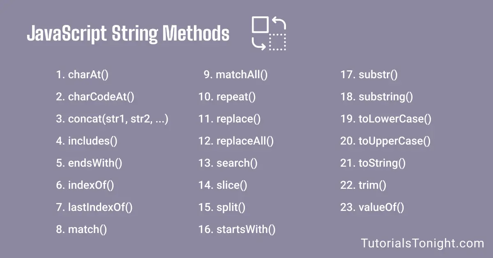
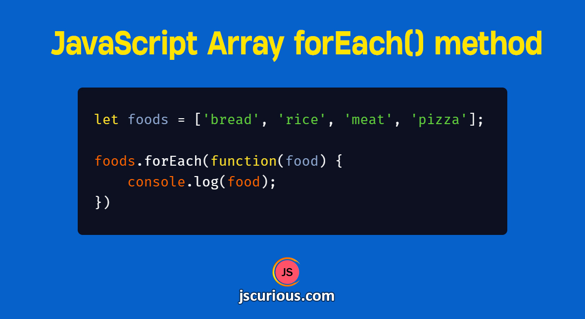

# Что такое Method в JavaScript
*Method* - это готовая функция, которую можно вызвать в любой момент и несколбко раз. *Method* - является *block* - кодом, также ей можно задать параметры чтобы уточнить его действия.

# Создание текста в JavaScript
Существует три способа создания текста в **JavaScript**, это: *"Double Quotes"* ( *"Двойные кавычки"* ), *'Single Quotes'* ( *'Одинарные кавычки'* ) и *Backticks* ( *Обратные кавычки* ).

# String methods в JavaScript   

# String method *charAt()*
String method который принимает индекс и возвращяет элемент этого идекса, например в слове: *Hello*, буква *o* имеет индекс 4 и если в method *charAt()* мы запишем 4 нам выведится буква *o*. 

 .jpg>)

# String method *at()*
Method *at()* имеет те же свойства что и method *charAt()*, но он также может принимать отрицательные числа такие как: -1, -2, -3 ...  

# String method *concat()*
Method *concat()* имеет свойства соединять несколько текстов во едино, не имеет значения что этот текст заключон в переменную или создана внутри него с аомощью ковычек.

# String method *replace()*
Эта функция может изменять текст переменрной на примую через команду то есть если наш текст "I love Dushanbe, but I want to live in Russia" то через метод *replace()* мы можем изменить какое-то слово например:  

 * "I love Dushanbe, but I want to live in Russia".replace("Russia", "Dubai")
 
Так мы именили слово  "Russia" на "Dubai".

# String method *replaceAll()*
Эта функция имеет свойства *replace()*, но изменения касаются всех похожих слов в тексте или переменной.

# String method *split()*
Этот метод позволяет приврошять текс в массив, а также имеет свойство распределять индексы по примелам, по тире и другим знакам или даже буквам.

# String method *substring()*
Эта функция берёт два параматра: первый (start), берёт начальный индекс то есть с какого индекса ему начать и второй (end), в каком индексе ему закончить, конечно можно задать только один пораметр например начать с нулевого и ненаписать второй он просто напичатает тест до конца. Но он не может брать отрицательные параметры.

# String method *slice()*
Таже функция *substring()*, но может принимать отрицательные числа.

# String method *toLowerCase()*
Эта функция делает все большие буквы в тесте или переменной малинькими.

# String method *toUpperCase()*
Полная пративоположность *toLowerCase()* эта функция делает все буквы в тексте большими.

# String method *trim()*
Эта функция прослто убирает все пробелы с левой и правой стороны.

# String method *includes()*
Это очень полезная и нужная функция, она может находить какое нибудь слово, букву, знак или даже пробел.

# String method *toString()*
Это очень простая функция она можеть превряшять чюбой символ или число в текст.

# String method *indexOf()*
Эта функция может находить число индекса, то есть можно написать какую либо букву теста то она покажеть индекс этой буквы, но усли в тексте несколько таких букв или символов то она пакажет самую ближайшую к насалу слова.

# String method *repeat()*
Эта функция можеть повторять какую либо букву или даже текст.

# Number methods в JavaScript   

.jpg>)

# Number methods *Math.round(),ceil(),floor*
Все эти функции являются матиматическими то есть помогают с матиматическими действиями в **JavaScript**. *Math.round()* - функция которая помогает округлять десятичное число до целого числа. *Math.ceil()* - эта функция помогает поднять цисло на еденицу выше если в числе присудствует десятая часть. *Math.floor* - противоположность *Math.ceil()* то есть уберает всю десятую часть числа и оставляет лишь целое число.

# Number methods *Math.max() and Math.min()*
Эти функции помогают найти наибольшее (*Math.max()*) или наименьшее (*Math.min()*) число из определённых чисел.

# Number methods *Math.pow() and Math.sqrt()*
*Math.pow()* - это функция которая помогает определить степень определённого числа, *Math.sqrt()* помогает найти корень определённого числа.

# Number methods *Math.abs() and Math.random()*
*Math.abs()* - это функция которая отрицательное число превращяет в положительное, *Math.random() случайно создаёт число от 0 - 1, чтобы число превычило отметку 1 нужно умножить её на 10.

# Number methods *isNaN()*
Эта функция которая проверяет является ли эта переменнная NaN или нет.

.jpg>)   
